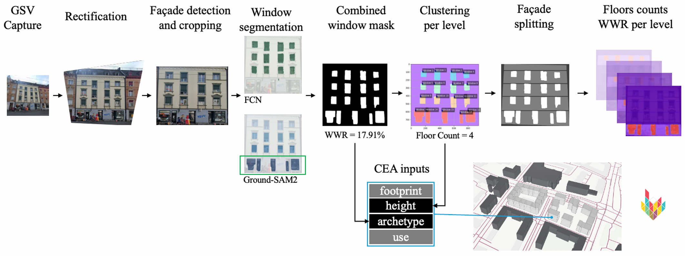
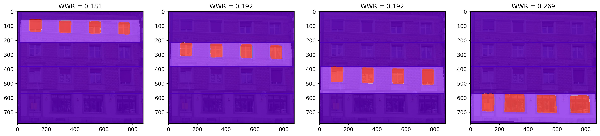
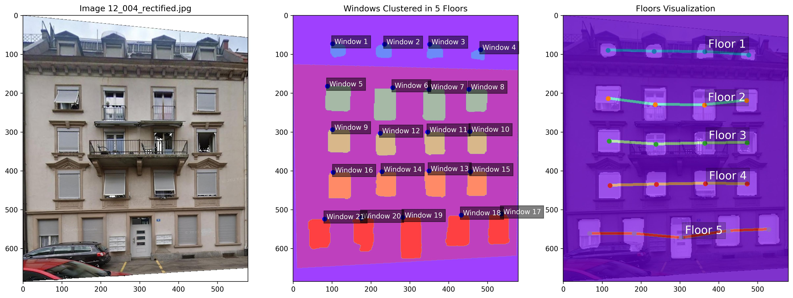

# Deep Learning-Based WWR and Floor Count Extraction from Façade Images to Improve UBEM

[Ayca Duran](https://systems.arch.ethz.ch/ayca-duran), [Panagiotis Karapiperis](https://www.linkedin.com/in/panagiotis-karapiperis-ethz/), [Christoph Waibel](https://systems.arch.ethz.ch/christoph-waibel), [Arno Schlueter](https://systems.arch.ethz.ch/arno-schlueter)

[[ Paper ]](tba) – CISBAT 2025



## Table of Contents
1. [Abstract](#abstract)
2. [Preparation](#preparation)
3. [Citation](#citation)

## Abstract
Urban Building Energy Modeling (UBEM) requires accurate input data such as floor counts and window-to-wall ratios (WWR), which are often missing from public datasets (e.g., OpenStreetMap). This project introduces a deep learning-based computer vision pipeline that automatically extracts these features from street-level façade imagery and integrates them into the City Energy Analyst (CEA) platform for urban-scale energy simulations.

## Preparation
#### Environment

The repository is desinged for:
- Python 3.11.9  
- CUDA 12.4 (if GPU available)  
- Tested on Windows 11

Please install PyTorch following the [official webite](https://pytorch.org/). In addition, you have to install other necessary dependencies. You may create a conda environemt and install all requirements using the following bash commands:

```bash
# 1️⃣ Create a new conda environment (Python 3.11.9)
conda create -n deepl_ubem python=3.11.9 -y

# 2️⃣ Activate the environment
conda activate deepl_ubem
```

```bash
pip3 install -r requirements.txt
```
#### Instructions
This repository comprises of 6 notebooks that perform different functions. Use the example images under example/images or place therein your own samples. Follow the step by step guide:

1) (Optional): Train the FCN model (ResNet50 model pretrained COCO with VOC labels) using the fcn_training.ipynb notebook. We use the zju_facade_jcst2020 dataset introduced in [Li et al., 2020](https://github.com/lck1201/win_det_heatmaps). Weights are saved under trained_models/fcn_resnet50. Otherwise, download our trained weights from [HF](https://huggingface.co/pkarapiperis/resnet50_deeplubem/tree/main) and place them in the same folder.

2) Create a [Roboflow API key](https://docs.roboflow.com/developer/authentication/find-your-roboflow-api-key) and run the facade_finder.ipynb notebook. The model can be found on our [Roboflow Workspace](https://app.roboflow.com/panagiotis-workspace/facade_finder/models). Facade masks will be saved under example/predictions/facades_roboflow.

3) Run the facade_transform.ipynb notebook to rectify images and facade masks. We use the rectifiation.py introduced in [Chaudhury et al. 2014, "Auto-rectification of user photos" IEEE](https://ieeexplore.ieee.org/document/7025706) and implemented in [github](https://github.com/chsasank/Image-Rectification?tab=readme-ov-file). The rectified images and facades are stored under example/rectified.

4) Run inference of the FCN model on the rectified images using the fcn_inference.ipynb notebook. Window predictions will be saved under example/predictions/fcn_resnet50_rectified.

5) This work introduces the merging of masks from zero-shot models. We use [Grounded-SAM-2](https://github.com/IDEA-Research/Grounded-SAM-2) to generate ground floor masks using the promt "entrance.". Follow their instructions and place the generated masks under example/predictions/gsam_rectified.

*Note: quality of models improves if cropped images are fed without rectification triangles.

6) Run the wwr_extraction.ipynb and floors_extraction_ipynb notebooks to extract relevant features. Results and figures are saved under example/WWR or FLOORS respectively.




## Citation
If using our dataset/model, please cite us as follows:
```bibtex
@article{DURAN2025112310,
  title     = {Deep Learning-Based WWR and Floor Count Extraction from Façade Images to Improve UBEM},
  journal   = {Journal of Physics: Conference Series},
  volume    = {tba},
  pages     = {tba},
  year      = 2025,
  issn      = {tba},
  doi       = {tba},
  author    = {Ayca Duran and Panagiotis Karapiperis and Christoph Waibel and Arno Schlueter}
}
```
